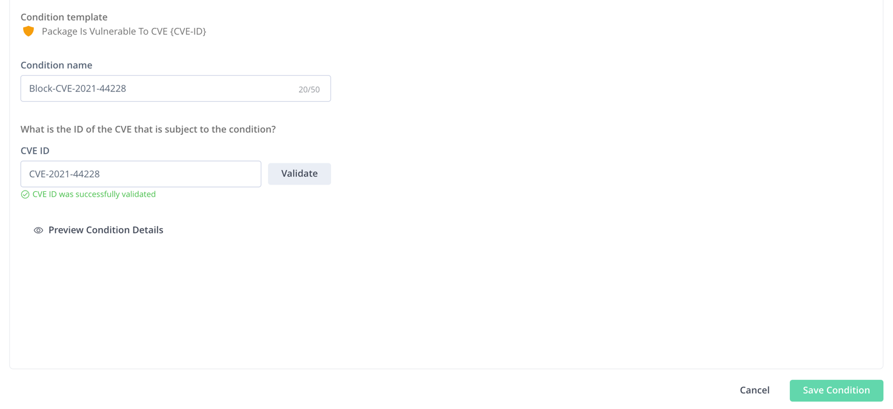

# 🏗️ JFrog SaaS Trial Workshop Guide - Basic Maven build and Xray scanning

Welcome to the JFrog SaaS Trial Workshop! 🎓 This guide will help you get started with JFrog SaaS, set up your trial environment, and practice building a Maven project using our GitHub sample repository.

---

## Prerequisite
- Java 8 and above
- Maven 3.6.x

## 🚀 1. Apply for a JFrog SaaS Trial

Before we begin, please apply for a JFrog SaaS trial environment:

👉 [Apply for JFrog SaaS Trial](https://jfrog.com/start-free/)

After registering, you will receive access to your own JFrog Platform instance in the cloud. Please ensure you have access to:

✅ **JFrog Artifactory (SaaS)**  
✅ **JFrog Xray (Optional)**

---

## 📦 2. Clone the Sample Maven Project

We will use a pre-prepared Maven project from the JFrog China GitHub repository as an example.

1️⃣ Clone the project:
```bash
git clone https://github.com/JFrogChina/jfrog-poc-samples.git
cd jfrog-poc-samples/maven-sample
```
2️⃣ Review the project structure:

maven-sample/
├── pom.xml
├── src/
│   └── ...
└── ...
This is a simple Java Maven project for demonstration purposes.

🏗️ 3. Create Maven Repositories Using Quick Repository Creation
🔹 3.1 Use Quick Repository Creation (Recommended for New Users)
1️⃣ Log in to your JFrog SaaS Platform.
2️⃣ In the top-right corner, click the Quick Repository Creation.
3️⃣ Select Maven as the package type.
4️⃣ Follow the prompts to quickly create:

A Local Repository (e.g., sample-maven-local)

A Remote Repository (e.g., sample-maven-remote, pointing to https://repo.maven.apache.org/maven2/)

A Virtual Repository (e.g., sample-maven, combining sample-maven-local and sample-maven-remote)

The Quick Setup will automatically configure the repositories and generate helpful examples.

✅ Verify that:

Local Repo: sample-maven-local

Remote Repo: sample-maven-remote

Virtual Repo: sample-maven (used for builds and dependency resolution)

🔗 4. Configure JFrog CLI
We will use JFrog CLI to interact with the JFrog SaaS environment.

1️⃣ Download JFrog CLI:
👉 JFrog CLI Download

2️⃣ Configure your SaaS environment (replace <YOUR_DOMAIN> with your JFrog SaaS domain):

bash

jf c add saas
Follow the prompts:

JFrog Platform URL: https://<YOUR_DOMAIN>.jfrog.io

Username: <your-username>

Password: <your-encrypted-password> (not plain password, but the encrypted password generated in JFrog UI)

🔑 How to get your Encrypted Password
Login to your JFrog SaaS UI.

Go to Profile (top-right) → Edit Profile → Generate Encrypted Password.

Copy the generated encrypted password and use it in the CLI configuration.

🛠️ 5. Configure Maven with jf mvnc
Run the following to configure Maven:


cd maven-sample
jf mvnc
Follow the prompts:

pgsql

Resolve dependencies from Artifactory? (y/n) [y]?
Set Artifactory server ID [saas]: 
Set resolution repository for release dependencies [sample-maven]: 
Set resolution repository for snapshot dependencies [sample-maven]: 
Deploy project artifacts to Artifactory? (y/n) [y]?
Set Artifactory server ID [saas]: 
Set repository for release artifacts deployment [sample-maven-local]: 
Set repository for snapshot artifacts deployment [sample-maven-local]: 
Would you like to filter out some of the deployed artifacts? (y/n) [n]? 
Use Maven wrapper? (y/n) [y]? 
✅ jf mvnc will automatically generate a settings.xml that points to your SaaS repositories.

🏗️ 6. Build and Deploy the Maven Project
Run the following commands to build and deploy the project to your SaaS instance:

bash

jf mvn clean install -f pom.xml --build-name=sample-maven-build --build-number=1
jf mvn deploy --build-name=sample-maven-build --build-number=1
jf rt bp sample-maven-build 1
This will:

Compile and package the project.

Upload artifacts (e.g., .jar files) to the sample-maven-local repository.

Record build information.

🔍 7. Verify in JFrog Platform
Login to your JFrog SaaS instance:

✅ Navigate to Artifactory → Artifacts to see your deployed artifacts.
✅ Navigate to Builds to view the build information (sample-maven-build).

🔒 8. Add sample-maven-local and Build to Xray Indexing
To enable security scanning in Xray:

1️⃣ Go to JFrog Xray → index resource.
2️⃣ Add the following resources to the watch:

Repositories: Add sample-maven-local.

Builds: Add sample-maven-build.

✅ This will enable Xray to scan both the repository and your build for vulnerabilities, licenses, and compliance issues.

9. Review the log4j vulnerability is applicable


## Curation

1. Create a condition to block log4j-2.14.0.jar.

Administrator -> Curation Settings -> Create Condition.



2. Create a curation policy containing this condition to block log4j.jar

3. Clean the local and remote repository cache

```bash
rm -rf ~/.m2/repository/org/apache/logging/log4j/* 
```
4. Try to pull the log4j-2.14.0.jar again

Error message was expected, showing log4j-core-2.14.0.jar is blocked.

```shell
[main] ERROR org.apache.maven.cli.MavenCli - Failed to execute goal on project app-boot: Could not resolve dependencies for project com.example.jfrog:app-boot:war:1.0.2: Could not transfer artifact org.apache.logging.log4j:log4j-core:jar:2.14.0 from/to artifactory-release (https://demo.jfrogchina.com/artifactory/alex-maven): authorization failed for https://demo.jfrogchina.com/artifactory/alex-maven/org/apache/logging/log4j/log4j-core/2.14.0/log4j-core-2.14.0.jar, status: 403 Forbidden -> [Help 1]
[main] ERROR org.apache.maven.cli.MavenCli - 
[main] ERROR org.apache.maven.cli.MavenCli - To see the full stack trace of the errors, re-run Maven with the -e switch.
[main] ERROR org.apache.maven.cli.MavenCli - Re-run Maven using the -X switch to enable full debug logging.
[main] ERROR org.apache.maven.cli.MavenCli - 
[main] ERROR org.apache.maven.cli.MavenCli - For more information about the errors and possible solutions, please read the following articles:
[main] ERROR org.apache.maven.cli.MavenCli - [Help 1] http://cwiki.apache.org/confluence/display/MAVEN/DependencyResolutionException
19:14:41 [🔵Info] Trace ID for JFrog Platform logs: e93bff9e94b80d59
19:14:41 [🚨Error] 403 Forbidden

```


5. Upgrade the log4j version to 2.17 to fix the issue
vi pom.xml
```shell
   <dependency>
       <groupId>org.apache.logging.log4j</groupId>
       <artifactId>log4j-core</artifactId>
       <version>2.17.1</version>
   </dependency>
```

6. Rebuild again to see the scan results
```shell
 jf mvn clean 
 jf mvn deploy --build-name=sample-maven-build --build-number=2
 jf rt bp sample-maven-build 2  
```
