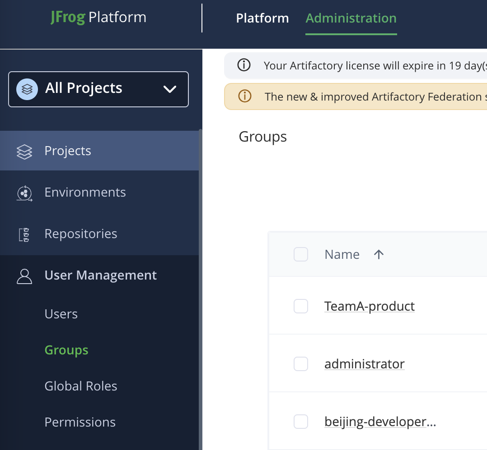
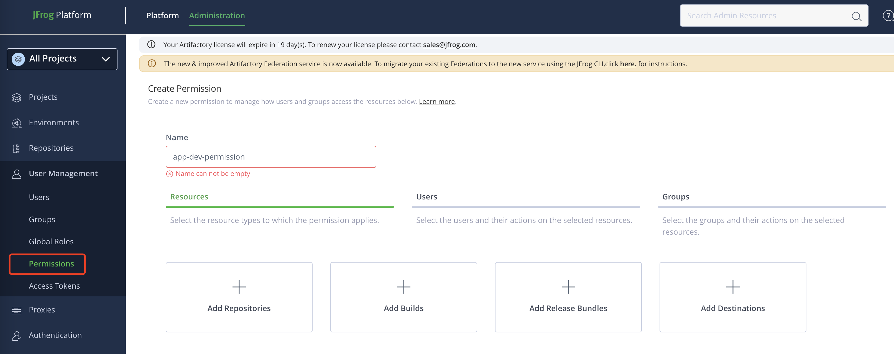
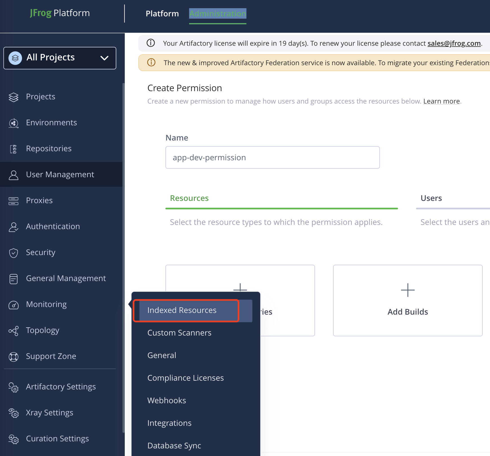
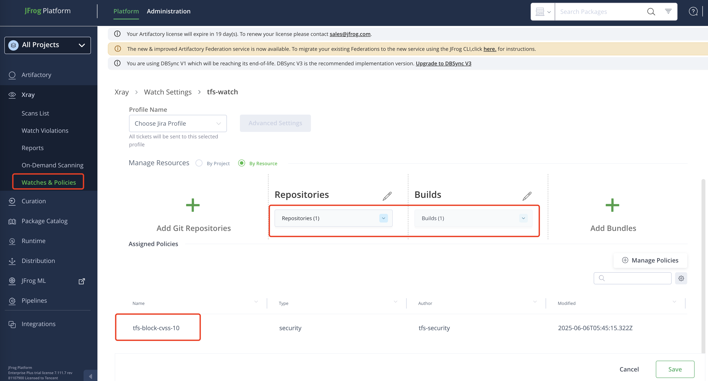

# 🛡️ JFrog Xray Best Practices Guide

This document outlines best practices for using **JFrog Xray** to ensure software supply chain security. It includes configuration recommendations, CI/CD integration, policy/watch setup, role-based access control, and more.

### Resource Types

| Resource Type | Description |
|--------------|-------------|
| Repositories | Indexes artifacts stored in JFrog Artifactory repositories. |
| Builds | Indexes CI/CD-generated builds, including all dependencies. |
| Release Bundles | Indexes software packaged for distribution. |

---

## 🔍 Table of Contents

1. [User Groups and Permissions](#user-groups-and-permissions)
2. [Repository and Permission Setup](#-repository-and-permission-setup)
3. [Environment Preparation](#-environment-preparation)
4. [Component Indexing and Scan Configuration](#-component-indexing-and-scan-configuration)
5. [Policies and Watches](#-policies-and-watches)
6. [CI/CD Integration](#-cicd-integration)
7. [JFrog Advanced Security](#-jfrog-advanced-security)
   - [Applicable vs. Non-Applicable Vulnerabilities](#-applicable-vs-non-applicable-vulnerabilities)
   - [Secrets Detection](#-secrets-detection)
8. [Curation](#-curation)
   - [Key Use Cases](#-key-use-cases)
   - [How Curation Works](#️-how-curation-works)
   - [How to Configure Curation](#️-how-to-configure-curation)
   - [Curation Rule Example Scenarios](#-curation-rule-example-scenarios)
   - [Testing & Validation](#-testing--validation)
   - [Best Practices](#-best-practices)
9. [References](#-references)

---

## 👥 User Groups and Permissions

### 🔧 Create User Groups


#### Group: `app-dev`

* Role: Developer  
* Permissions:  
  * Deploy, Read, Annotate, Delete on selected repos (e.g., `app-dev-local`)  
  * No access to Xray metadata configuration

#### Group: `app-security`

* Role: Security Engineer  
* Permissions:  
  * Manage Xray Policies, Watches  
  * Manage Xray metadata on repos  
  * Read access to necessary repos (optional)

### 🔐 Add Users to Groups

1. Go to **Identity & Access > Users**
2. Edit user `app-dev`, assign group `app-dev`
3. Edit user `app-security`, assign group `app-security`

---

## 📁 Repository and Permission Setup

### 🔐 Create Permission Target


1. Go to **administration & User Management > Permissions**
2. Create new target: `app-dev-permission`
3. Attach `app-dev-local` repository
4. Set group permissions:

| Group          | Read | Deploy | Delete | Annotate | Manage Xray Metadata |
| -------------- | ---- | ------ | ------ | -------- | -------------------- |
| `app-dev`      | ✔️   | ✔️     | ✔️     | ✔️       | ❌                    |
| `app-security` | ✔️   | ❌      | ❌      | ❌        | ✔️                   |

---

## 📦 Indexing Repository and Builds


* Enable Xray indexing on key repositories like `app-dev-local`, `maven-local`, `docker-prod`.
* Avoid indexing temp/cached repositories like `*-cache`.

---

## 📝 Policies and Watches

### 🔧 Creating Policies

1. Navigate to **Platform -> Xray -> Policies**.
2. Click **Create Policy**, then:
   * Name: `backend-prod-vuln-policy`
   * Type: `Security`, `License`, or `Operational Risk`
3. Add rules:
   * Security: CVE severity ≥ High or CVSS ≥ 9.0
   * License: Not in whitelist
   * Operational: Unscannable component
4. Set actions: Fail Build, Block

### 📖 Policy Naming Convention

```
<team>-<context>-<type>  e.g., frontend-prod-license-policy
```

### 🔍 Creating Watches


1. Navigate to **Platform -> Xray -> Watches**
2. Click **Create Watch**, set name and scope (repositories, builds, or bundles)
3. Attach previously created policies

### 📊 Policy + Watch Examples

| Use Case             | Target        | Rules                    | Action      |
| -------------------- | ------------- | ------------------------ | ----------- |
| Production security  | `app-dev-local` | CVSS Score = 10               | Block download  |
| CI License blocking  | `Build: ci-*` | License not in whitelist | Fail Build  |
| Audit-only licensing | All repos     | License is GPL           | Notify only |

---

## 🚀 CI/CD Integration

* 创建 Maven build  
参考 [Maven Build Sample](https://github.com/JFrogChina/jfrog-poc-samples/tree/main/maven-sample)

* Use **JFrog CLI** to trigger build scans:

```bash
jf bs sample-maven-build 1 --rescan=true 
```

* Pipeline steps:

  1. Build & Upload Artifacts  
  2. Upload Build Info  
  3. Trigger Xray scan via CLI  
  4. Enforce result-based gating (fail if policy violated)

---

## 🔒 JFrog Advanced Security
* Use **Contextual Analysis** to reduce false positives.

### Contextual Analysis

* Analyzes how vulnerabilities are actually used in your code  
* Reduces false positives by understanding code context  
* Provides more accurate risk assessment

### ✅ Applicable vs. Non-Applicable Vulnerabilities

**JFrog Advanced Security** introduces **applicability analysis** — a powerful feature that helps security teams focus only on vulnerabilities that pose a **real, contextual threat** to your code.

#### 🔎 What Does "Applicable" Mean?

A vulnerability is considered **applicable** if:

- The vulnerable function or code path is **actually invoked** by your code  
- It is **reachable** at runtime through the application's dependency chain  
- It is **not mitigated** by dead code, unused libraries, or configuration  

#### 🚫 Non-Applicable = No Immediate Risk

If a CVE exists in a library, but your application **doesn't use or reach the vulnerable code**, Xray will mark it as **non-applicable**. This helps eliminate **false positives** and prioritize fixes based on actual risk.

#### ✅ Benefits of Applicability Analysis

| Benefit                  | Description                                        |
|--------------------------|----------------------------------------------------|
| 🎯 Reduces Noise         | Focus only on vulnerabilities that matter         |
| 🧠 Smarter Remediation   | Fix vulnerabilities with real execution paths     |
| 📉 Fewer False Positives | Saves time and avoids unnecessary rebuilds        |

#### 🔬 Technical Context

Applicability analysis uses:

- **Static code analysis** to trace execution paths  
- **Call graphs** to analyze reachability of vulnerable methods  
- Language-specific analyzers (Java, Python, JS/TS, etc.)

#### 📌 Example

> A CVE is detected in `log4j-core`.  
> Xray analyzes your code and determines that:  
> - You include `log4j-core`  
> - But you **never call** the vulnerable API `JndiLookup`  
>
> ✅ Result: CVE is marked as **Non-Applicable**  
> ❗ Only if you later start using `JndiLookup`, it will become **Applicable**

#### 🔐 Summary

| Term             | Meaning                                                  |
|------------------|----------------------------------------------------------|
| **Applicable**     | Vulnerability is reachable and exploitable in your code |
| **Non-Applicable** | Vulnerability is present in a dependency but unused or unreachable |

Use this feature to **focus remediation**, reduce noise, and strengthen your **DevSecOps pipeline**.

### Secrets Detection

* Scans for exposed secrets and credentials  
* Supports multiple secret types (API keys, passwords, tokens)  
* Integrates with CI/CD pipelines

---
## 🛡️ Curation

**JFrog Curation** helps organizations block undesirable open-source components *before* they enter the system. It acts as a **first line of defense** to prevent high-risk or non-compliant packages from being downloaded.

### 🎯 Key Use Cases

- Prevent introduction of **vulnerable components** with known CVEs  
- Block components with **non-compliant licenses** (e.g., GPL, AGPL)  
- Enforce **package version** or **type restrictions**  
- Maintain a **controlled and approved component baseline**

### ⚙️ How Curation Works

Curation is enforced **at the download stage** (e.g., when developers fetch dependencies via `npm`, `pip`, `maven`, etc.). It checks all requests from **remote repositories** against defined **rules**.

If a request violates a rule, the download is blocked **before the artifact reaches the developer or build agent.**

### 🛠️ How to Configure Curation 

https://jfrog.com/help/r/jfrog-security-user-guide/products/curation/configure-curation

### 📈 Curation Rule Example Scenarios

| Name                       | Conditions                              | Target Repository      | Action         |
|----------------------------|------------------------------------------|------------------------|----------------|
| `block-critical-cve`       | CVSS ≥ 9.0                               | `maven-central-remote` | Block Download |
| `block-gpl-licenses`       | License IN [GPL, AGPL]                   | `npmjs-remote`         | Block Download |
| `block-unscannable`        | Component cannot be scanned              | All remotes            | Block Download |
| `disallow-legacy-packages` | Version < 1.0.0                          | `pypi-remote`          | Block Download |

### 🧪 Testing & Validation

Before applying to production:

1. **Create a test rule** targeting a dev-only repository  
2. Attempt to download blocked components (e.g., via `curl`, `npm install`, `mvn clean install`)  
3. Confirm that requests are blocked with proper error messages  
4. Review audit logs under `JFrog Platform > Curation > audit`

### 📋 Best Practices

- ✅ Start with **critical CVEs** (CVSS ≥ 9.0) to minimize disruption  
- ✅ Maintain a **license whitelist**, and block all others by default  
- ✅ Document all exceptions with justification and approver info  
- ✅ Review rules **quarterly** or during security events  
- ✅ Educate development teams on why and how curation is enforced

### 📌 Summary

| Feature              | Benefit                                  |
|----------------------|------------------------------------------|
| CVE Filtering        | Block high-risk vulnerabilities          |
| License Filtering    | Ensure legal and compliance safety       |
| Download Interception| Prevent risky components from entering   |
| Policy Governance    | Maintain traceable, auditable rules      |

## 📃 References

* [JFrog Xray Documentation](https://jfrog.com/help/r/jfrog-security-user-guide/products/xray)
