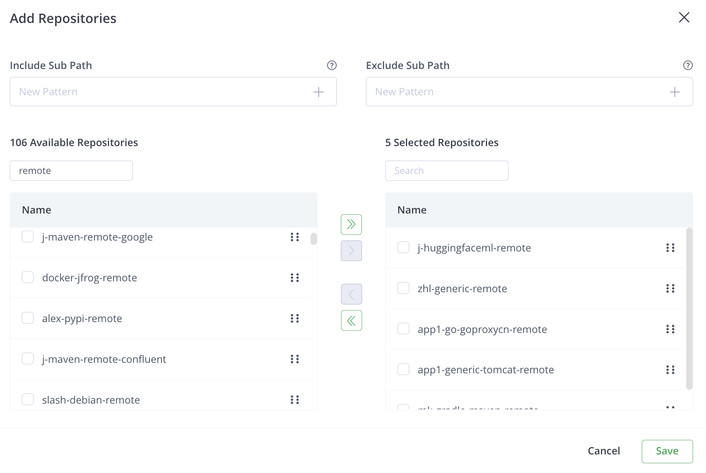
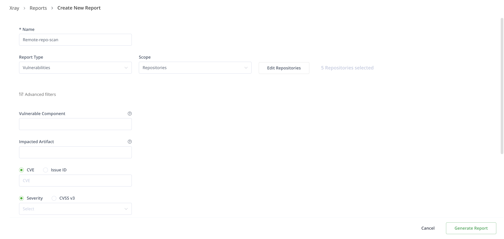
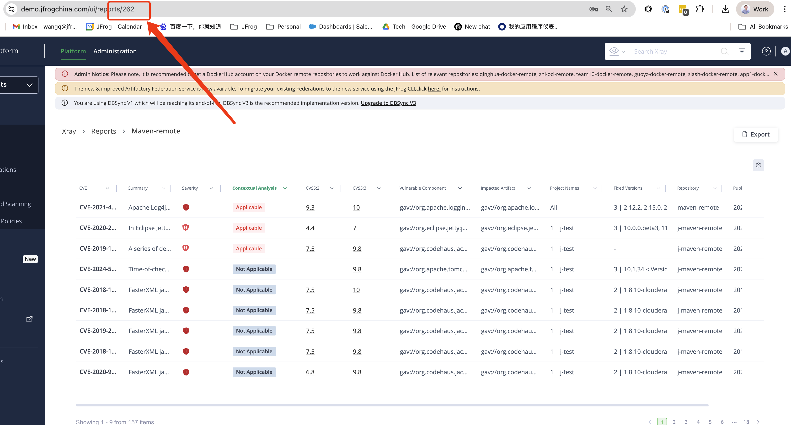
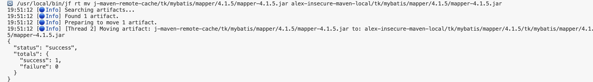
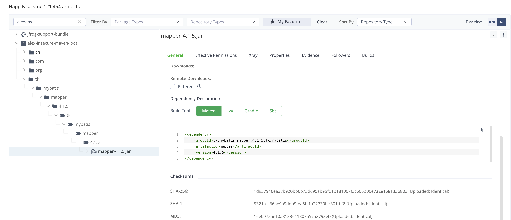

# 🛡️ Xray Vulnerability Report Exporter

This script extracts vulnerable artifact paths from a JFrog Xray report and optionally moves them to a target repository using the `jfrog rt mv` CLI command. It also detects remote repositories and converts them to `-cache` format for source path resolution.

---

## 🔧 CLI Arguments

| Argument         | Required | Description                                                                 |
|------------------|----------|-----------------------------------------------------------------------------|
| `--url`          | Yes      | Base URL of your JFrog instance, e.g., `https://art-server.com`       |
| `--report-id`    | Yes      | ID of the Xray vulnerability report                                        |
| `--token`        | Yes      | JFrog Access Token                                                          |
| `--target-repo`  | Yes      | Target repository to move vulnerable artifacts to                          |
| `--output`       | No       | Output file name (.xlsx or .csv). Defaults to `vulnerable_paths.xlsx`      |

---

## 🚀 Example Usage

```bash
python xray_vuln_report_export.py \
  --url https://art-server.com \
  --report-id 262 \
  --token <YOUR_ACCESS_TOKEN> \
  --target-repo alex-insecure-maven-repo \
  --output vulnerable_paths.xlsx
```

---

## 📦 Features

1. **Fetch Vulnerabilities**: Paginates and extracts paths from a specified Xray report.
2. **Export**: Outputs all paths to `.xlsx` or `.csv` without headers.
3. **Repository Detection**: Auto fetches repository types via Artifactory API.
4. **Path Normalization**: Appends `-cache` to source repository name for remote repo resolution.
5. **Move Artifacts**: Uses `jfrog rt mv` to relocate vulnerable artifacts to a specified repository.

---

## ✅ Prerequisites

- Python 3.6+
- `jfrog` CLI installed and configured (must be accessible via `PATH`)
- Required Python libraries:

```bash
cd scan-report
python3 -m venv venv  
source venv/bin/activate
pip install requests pandas openpyxl
```

---

## 📁 Sample CSV Output

```
maven-remote/org/apache/log4j/log4j-core/2.14.0/log4j-core-2.14.0.jar
npm-remote/@lodash/lodash/4.17.21/package.tgz
```

---

## ⚠️ Notes

- All source repos are transformed by appending `-cache` (e.g., `maven-remote` → `maven-remote-cache`)
- The move command runs `jfrog rt mv <source> <target>` for each artifact
- Script prints warnings and continues if a move command fails

---

1. Select remote maven repo to generate report
   
2. Click report generate
   
3. Click export to see the report id
   
4. Execute the python script, passing the id 262 in the command
```bash
python xray_vuln_report_export.py \
  --url https://art-server.com \
  --report-id 262 \
  --token <YOUR_ACCESS_TOKEN> \
  --target-repo alex-insecure-maven-repo \
  --output vulnerable_paths.xlsx
```
5. See the logs and review the content under the target repo.
All the vunlarable packages has been moved into the target reo


