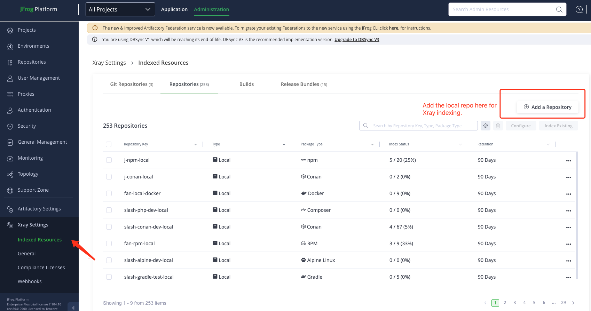

# Python Project Setup for Artifactory

## Prerequisites
- macOS system
- Python 3.x installed
- Access to Artifactory instance

## 1. Set Up the Project
### Navigate to the project directory:
```sh
cd ./python
```

### Ensure `requirements.txt` file exists to manage dependencies:
```sh
ls requirements.txt
```

### Create Artifactory Repositories for PyPI
#### Create a Local Repository
1. Log in to your Artifactory instance.
2. Go to the "Admin" tab.
3. Under "Repositories", select "Local".
4. Click "New" and choose "pypi" as the package type.
5. Name the repository (e.g., `pypi-local`).
6. Save the repository.

#### Create a Remote Repository
1. Under "Repositories", select "Remote".
2. Click "New" and choose "pypi" as the package type.
3. Name the repository (e.g., `pypi-remote`).
4. Set the URL to the PyPI registry (e.g., `https://pypi.org`).
5. Save the repository.

#### Create a Virtual Repository
1. Under "Repositories", select "Virtual".
2. Click "New" and choose "pypi" as the package type.
3. Name the repository (e.g., `pypi-virtual`).
4. Add the local and remote repositories created earlier to the virtual repository.
5. Save the repository.

### Add the Local Repository to JFrog Xray Indexed Repositories
1. Log in to your JFrog Platform.
2. Go to the "Administrator" module.
3. Navigate to "Xray" > "Index Repositories".
4. Click "Add Repositories".
5. Select the local repository (e.g., `pypi-local`) to be indexed by Xray.
6. Save the changes.



## 2. Set Up Artifactory for Dependency Management
### Configure pip to use Artifactory:
Create or edit the pip configuration file:

On macOS:
```sh
vi ~/.pypirc
```

Add the following:
```ini
[distutils]
index-servers = alex-pypi
 
[alex-pypi]
repository = https://<Artifactory-instance>.jfrog.io/artifactory/api/pypi/alex-pypi
username = <USERNAME>
password = <PASSWORD>
```
Replace `<USERNAME>`, `<PASSWORD>`, `<Artifactory-instance>`, and `alex-pypi` with your Artifactory instance details.

## 3. Install Dependencies

### Add a known critically vulnerable third-party Python package to `requirements.txt`:
```
requests==2.25.1
django==1.11.29  # Known critical vulnerability
```

### Install the dependencies:
```sh
pip install -r requirements.txt
```

## 4. Generate a Distribution Package

### Create a `setup.py` file with dependencies:
```python
from setuptools import setup, find_packages

setup(
    name='my_python_project',
    version='0.1.0',
    packages=find_packages(),
    install_requires=[
        'requests==2.25.1',
        'django==1.11.29',  # Known critical vulnerability
    ],
)
```

### Build the package:
```sh
python setup.py sdist
```

## 5. Upload Your Package to Artifactory
### Install `twine`:
```sh
pip install twine
```

### Upload the package:
```sh
twine upload --repository-url https://<ARTIFACTORY_URL>/artifactory/api/pypi/<REPO_NAME> dist/*
```
Replace `<ARTIFACTORY_URL>` and `<REPO_NAME>` with your Artifactory instance details.

## 6. View the Uploaded Python File and See the Xray Results
1. Log in to your Artifactory instance.
2. Navigate to the "Artifacts" tab.
3. Browse to the `pypi-local` repository and locate your uploaded Python package.
4. Click on the package to view its details.
5. Go to the "Xray" tab to see the security scan results.
6. Review any vulnerabilities or issues detected by Xray and take appropriate action.

### URL of the Uploaded Package
You can view the uploaded package at:
```
https://<ARTIFACTORY_URL>/ui/repos/tree/Xray/<pypi-local>/my-python-project/0.1.0/my_python_project-0.1.0.tar.gz
```
Replace `<ARTIFACTORY_URL>` and `<pypi-local>` with your Artifactory instance details and the path to your uploaded package.