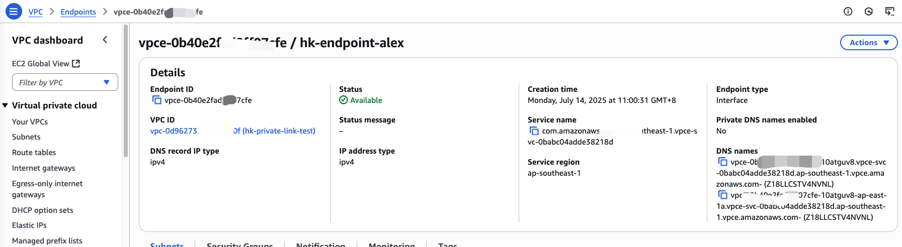

# Configuring AWS and JFrog Private Link

This document outlines the steps to configure AWS and JFrog Private Link to ensure a secure connection using AWS VPC endpoints. We will include instructions for creating the endpoint and security rules.

## Prerequisites

- Ensure you have an AWS account with permissions to create VPCs, Endpoints, and Security Groups.

## Step 1: Create a VPC Endpoint

1. **Login to AWS Management Console:**
   - Go to the [AWS Management Console](https://aws.amazon.com/console/).

2. **Navigate to VPC:**
   - Go to the `VPC` console.

3. **Create Endpoint:**
   - In the left menu, select `Endpoints`.
   - Click on the `Create Endpoint` button.

4. **Select the Service:**
   - Choose `Find service by name`.
   - Enter the JFrog service name, e.g., `com.jfrog.xray`.

5. **Select VPC:**
   - Choose the VPC that you want to connect to JFrog.

6. **Configure Subnets:**
   - Select the appropriate subnets of the VPC.

7. **Configure Security Groups:**
   - Select one or more security groups to control access to this endpoint.

8. **Create Endpoint:**
   - Click `Create Endpoint`.

## Step 2: Create a Security Group

1. **Navigate to Security Groups:**
   - Go to the `VPC` console and select the `Security Groups` section.

2. **Create Security Group:**
   - Click on `Create security group`.

3. **Input Details:**
   - Enter a name and description for the security group.

4. **Configure Inbound Rules:**
   - Allow traffic from the VPC (e.g., allow port 443 for HTTPS).

5. **Configure Outbound Rules:**
   - Allow internet access or access to other VPCs.

6. **Create Security Group:**
   - Click `Create security group`.

## Step 3: Update Endpoint Configuration

- Return to the VPC Endpoint you created and ensure the security group created in Step 2 is associated with this Endpoint.

## ASCII Flowchart

Here's a simple ASCII flowchart representing the configuration process between AWS and JFrog Private Link:
