# Configuring AWS and JFrog Private Link

This document outlines the steps to configure AWS and JFrog Private Link to ensure a secure connection using AWS VPC endpoints. We will include instructions for creating the endpoint and security rules.

## Prerequisites

- Ensure you have an AWS account with permissions to create VPCs, Endpoints, and Security Groups.

## Step 1: Create a VPC Endpoint

1. **Login to AWS Management Console:**
   - Go to the [AWS Management Console](https://aws.amazon.com/console/).

2. **Navigate to VPC:**
   - Go to the `VPC` console.
   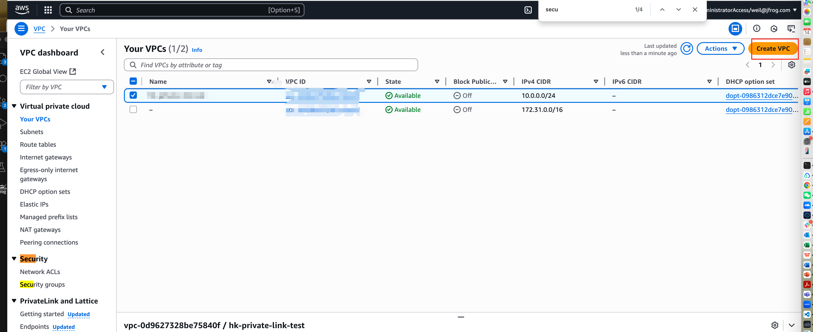

3. **Create Endpoint:**
   - In the left menu, select `Endpoints`.
   - Click on the `Create Endpoint` button.
   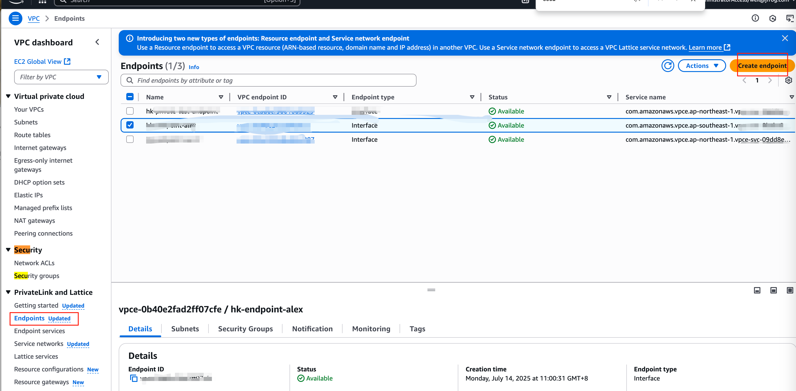
4. **Select the Service:**
   - Choose `PrivateLink Ready partner services`.
   - Enter the JFrog service name, e.g., `com.amazonaws.vpce....`.( Find in https://jfrog.com/help/r/myjfrog-portal/step-1-create-the-endpoint-in-aws)
   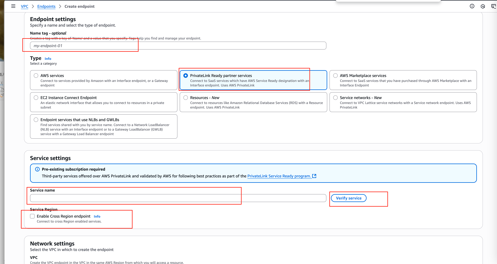
5. **Select VPC:**
   - Choose the VPC that you want to connect to JFrog.
   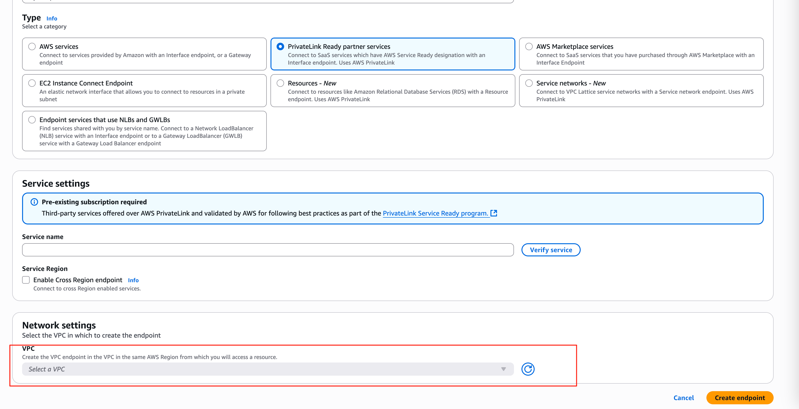
   - VPC need to config `DNS hostnames Enabled`
   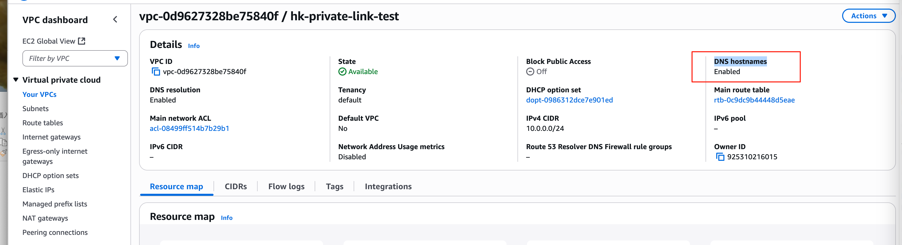 
6. **Configure Subnets:**
   - Select the appropriate subnets of the VPC.
   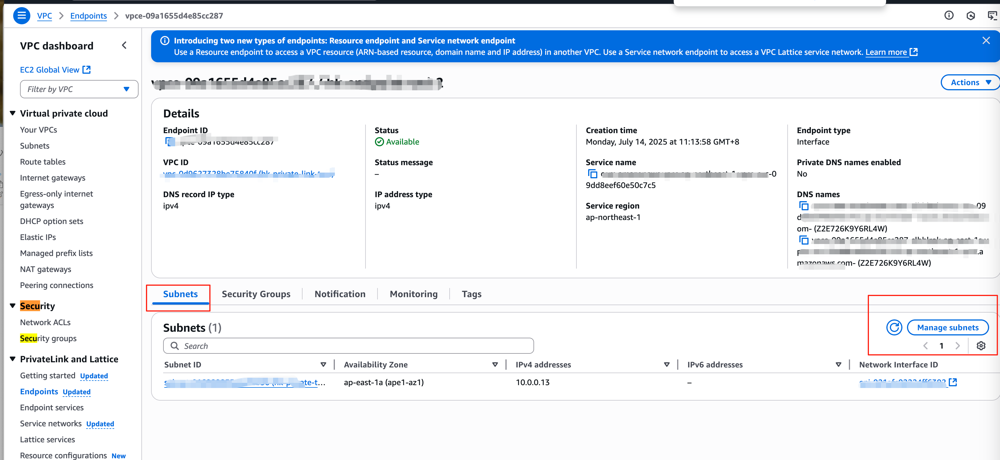
7. **Configure Security Groups:**
   - Select one or more security groups to control access to this endpoint.
   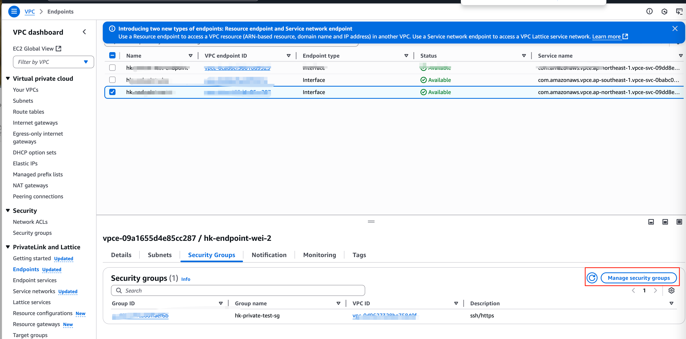
   - Security group need to peon port 443  for outbound connections.
   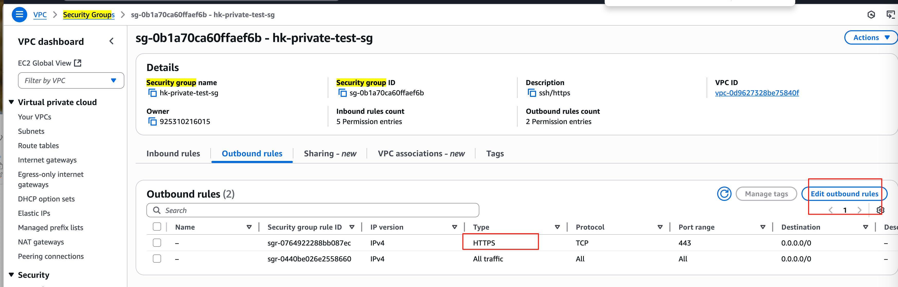
8. **Create Endpoint:**
   - Click `Create Endpoint`.

## Step 2: Setup Endpoint Configuration In JFrog 

1. **Create Endpoint In MyJFrog:**
   - Login MyJFrog ，choose `Security -- Private Connections`
   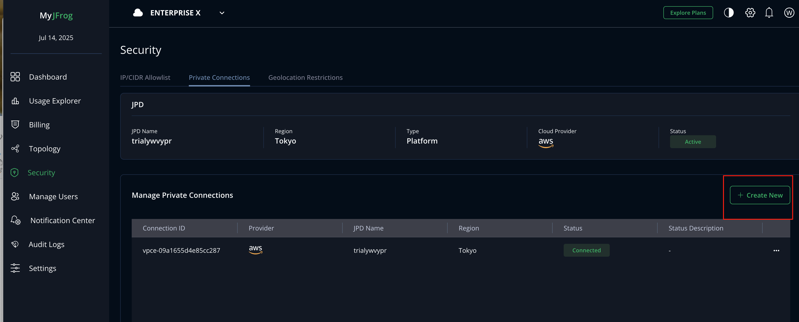

2. **Create Endpoint:**
   - Config Endpoint ID in MyJFrog
   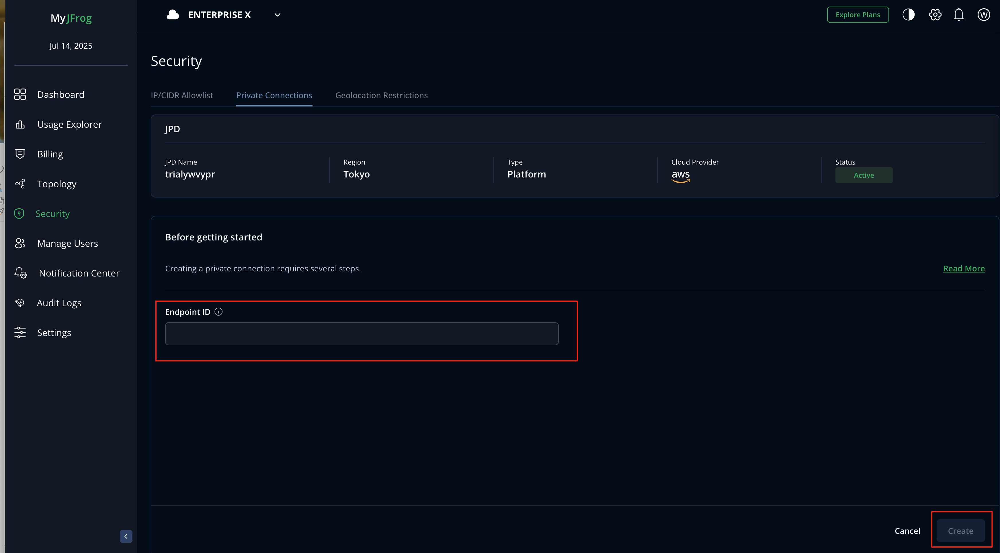
   - You can find you Endpoint IN in AWS Endpoint Page
   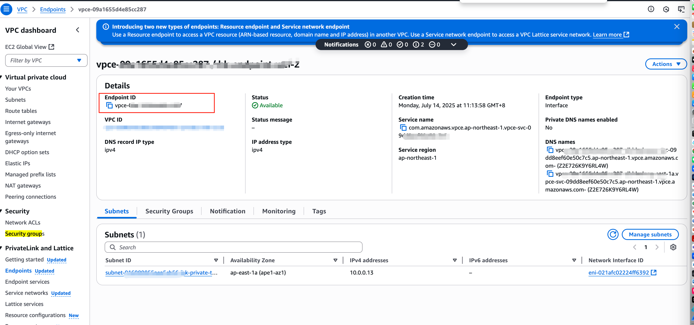

## Step 3: Setup DNS in Route53

1. **Create Hosted zone in Route53:**
   - Open AWS Route53 console
   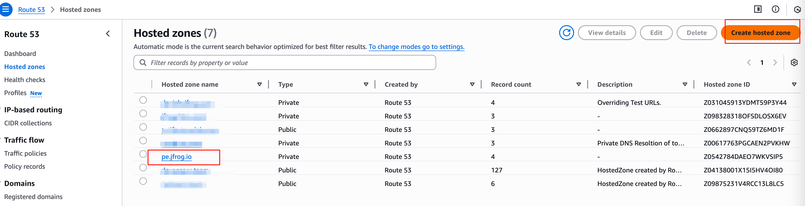

2. **Create Private Hosted zone:**
   - Setting up private hostedzone for you VPC
   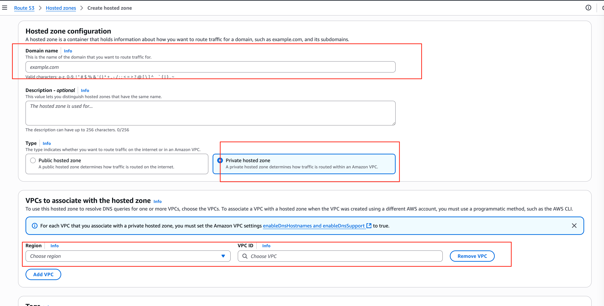

2. **Create Private Record For you JFrog :**
   - Add a CNAME record 
   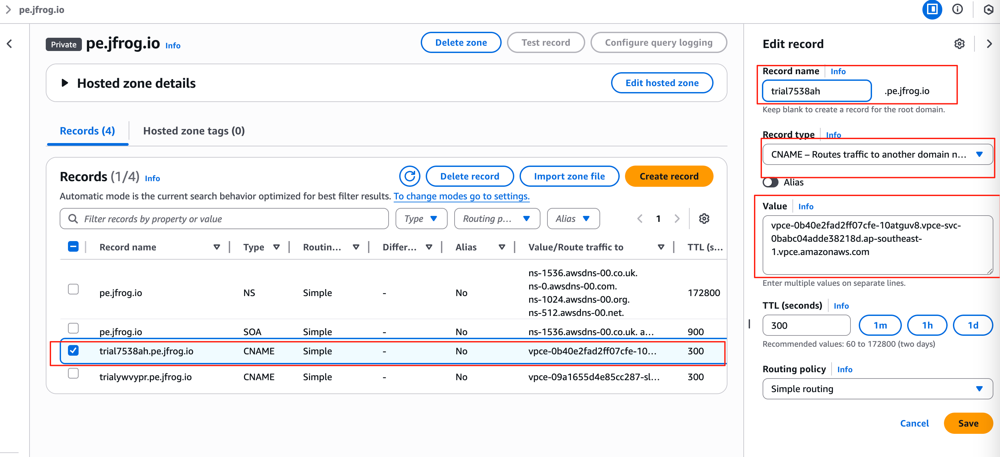
2. **Verify your connection from your VM to jfrog saas platform :**
  ```
[ec2-user@ip-10-0-0-12 ~]$ nslookup yoursaas.pe.jfrog.io
Server:		10.0.0.2
Address:	10.0.0.2#53
  ```
   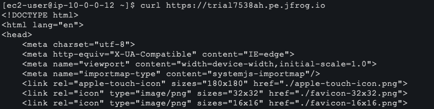